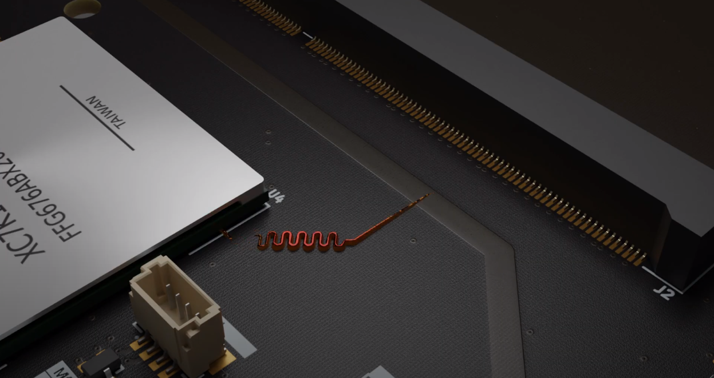

# KiCad SI wrapper - tool to prepare input data for SI simulation

Copyright (c) 2023-2024 [Antmicro](https://www.antmicro.com)



This project includes a collection of Python scripts that support the process of
generating assets from KiCad PCB files, which can be then used for performing
Signal Integrity (SI) simulation.
Those scripts integrate with the
[gerber2ems](https://github.com/antmicro/gerber2ems) /
[openEMS](https://github.com/thliebig/openEMS) simulation flow.
You can learn more about the PCB SI simulation flow from a dedicated
[blog article](https://antmicro.com/blog/2023/11/open-source-signal-integrity-analysis/).
The KiCad SI wrapper allows you to automatically identify a PCB trace of interest
and isolate it from the PCB design,
so just the single trace itself can be used for simulation.

## Documentation

Visit the
[si-wrapper documentation](https://antmicro.github.io/kicad-si-simulation-wrapper)
for more information about using `si-wrapper`.

## Installation

### Requirements

`si-wrapper` requires `KiCad 7.0.x`, `python >= 3.10`, `pip` and `gerbv`.

> Note: The provided scripts were tested with KiCad 7.0.11 and Debian 12.

### Installation (Debian)

1. Configure `PATH`:

    ```bash
    export PATH=$HOME/.local/bin:$PATH
    ```

2. Install requirements:

     
    ```bash
    echo 'deb http://deb.debian.org/debian bookworm-backports main' > /etc/apt/sources.list.d/backports.list
    apt update
    apt install python3 python3-pip gerbv
    apt install -t bookworm-backports kicad
    ```


3. Clone and install `si-wrapper`:

    ```bash
    git clone https://github.com/antmicro/kicad-si-simulation-wrapper
    cd kicad-si-simulation-wrapper
    pip install .
    ```

## Usage

```console
> si-wrapper [OPTIONS] COMMAND [ARGS]...
```

**Options**:

* `--help`: Show this message and exit.

**Commands**:

* `gerber2png`: Generates a bitmap `.png` file of the selected net.
* `renumerate`: Allows you to remove unused `Simulation Port` footprints from
    the generated slice and automatically updates the `simulation.json` file.
* `settings`: Generates configuration files for the net-slices.
* `slice`: Generates simulation cases by creating slices of designated nets
    from the source PCB.

## `si-wrapper gerber2png`

Generates a bitmap `.png` file of the selected net.

**Usage**:

```console
> si-wrapper gerber2png [OPTIONS]
```

**Options**:

* `--help`: Show this message and exit.

## `si-wrapper renumerate`

Allows you to remove unused `Simulation Port` footprints from the generated slice
and automatically updates the `simulation.json` file.

**Usage**:

```console
> si-wrapper renumerate [OPTIONS]
```

**Options**:

* `--help`: Show this message and exit.

## `si-wrapper settings`

Generates configuration files for the net-slices.

**Usage**:

```console
> si-wrapper settings [OPTIONS]
```

**Options**:

* `-i, --input PATH`: Initial .json input path
* `-o, --output PATH`: Net config output path
* `--help`: Show this message and exit.

## `si-wrapper slice`

Generates simulation cases by creating slices of designated nets from the source PCB.

**Usage**:

```console
> si-wrapper slice [OPTIONS]
```

**Options**:

* `-f, --file PATH`: Path to the settings file
* `-l, --list`: List Net classes with corresponding nets
* `--debug`: Increase logs verbosity
* `--help`: Show this message and exit.

## License

This project is licensed under the [Apache-2.0](LICENSE) license.
