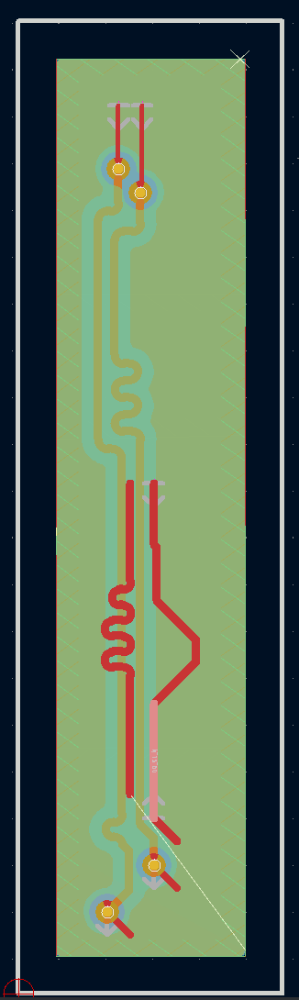
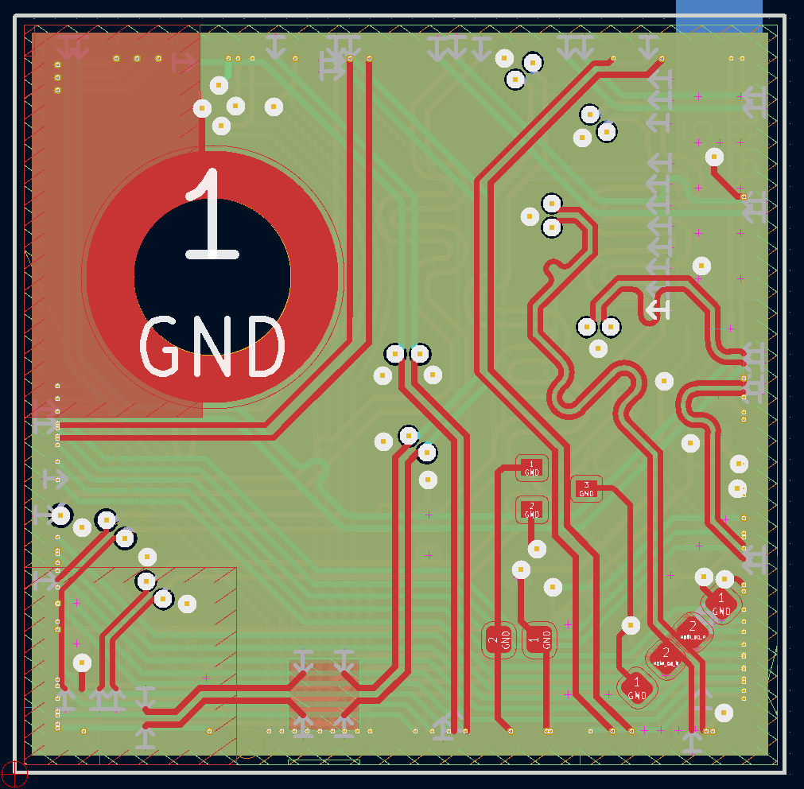

# KiCad SI wrapper - tool to prepare input data for SI simulation

Copyright (c) 2024 [Antmicro](https://www.antmicro.com)

This project contains scripts that allow users to generate input data for [gerber2ems](https://github.com/antmicro/gerber2ems) script - `.kicad_pcb` and `simulation.json` files.

## Installation

Instructions shown below allow requirements and script installation.

First of all, install KiCad on your local machine. It contains a `pcbnew` library which is essential for the wrapper:

```bash
apt install kicad
```

### Scripts installation

```bash
git clone https://github.com/antmicro/kicad-si-simulation-wrapper-scripts
cd kicad-si-simulation-wrapper-scripts/
pip install .
```

## Scripts description

* `wrapper_slicer` - it cuts out an area of PCB containing specified (designated), impedance  controlled single ended net or differential nets with or without neighbouring tracks. The size of the slice is defined by the span of the designated net(s). Coordinates of each designated track (track is a part of a whole net) defines the minimal size of the new `Edge Cuts` layer that defines the new PCB. If any pad intersects the generated `Edge Cuts` layer, then the size of the layer is changed to contain a whole pad. It also creates a `simulation.json` file with defined `Simulation Ports` and default config.

Remaining nets that are not in controlled impedance class are defined as GND.
Nets that were discontinued/cut at the moment of defining new `Edge Cuts` boundaries have to be properly terminated. Controlled impedance nets are terminated with a Simulation Port, other with GND via.

* `wrapper_renumerator` - allows users to remove additional Simulation Port footprints from Net Slice and automatically updates `simulation.json` file. It can only update already existing ports on the board - not manually added ones.
* `wrapper_settings` - creates a set of slice configs defined in a separate `.json` file.
* `constant.py` - library file, contains all necessary constant variables.
* `config.py` - library file, contains classes for JSON format handling.
* `pcbslicer.py` - library file, contains a class for creating net slices.
* `wrapper_gerb2png.py` - script that creates a bitmap of a designated net, basing on gerber files.

## Slicing script

### `wrapper_slicer`

This script needs to be used inside a directory containing `.kicad_pcb` file. What is more, to use its slicing feature `slice_config.json` containing configuration must be included. It is important to point out that all nets that are designated have to be named according to the Antmicro standard of impedance controlled nets.

* To run help, type:

    ```bash
    wrapper_slicer -h
    ```

* To run script with selected slice configuration file, type:

    ```bash
    wrapper_slicer -s path_to/slice_config.json
    ```

* To check nets and class membership, type:

    ```bash
    wrapper_slicer -l 
    ```

* To run in debug mode add option:

    ```bash
    --debug
    ```

When script is used, a designated net's subdirectory is created inside `slices` directory. Below shown example of directory structure:

```bash
slices/
└── {net_name}/
  ├── fp-info-cache
  ├── simulation.json
  ├── {net_name}.kicad_pcb
  ├── {net_name}.kicad_prl
  └── {net_name}.kicad_pro
```

`slices` directory can contain multiple nets, as many as defined on the board.
If a differential pair is designated, then the name of the directory and files ends with `_PN`.

## Additional scripts

Scripts that are helpful when working with netslices. It is not obligatory to use them.

### `wrapper_renumerator`

Below are steps how to use the script:

1. Remove/move redundant Simulation Ports from created slice
2. Use the script inside `slices/{net_slice}`
3. Inspect `simulation.json`. It automatically updates `simulation.json`, but is highly recommended to check if everything was generated correctly.

It can be run by using:

```
wrapper_renumerator 
```

inside the `slicer/{net_slice}` directory.

### `wrapper_settings`

To use it, first create an `init.json` file. Define `board`, `netclass` or or just type `all` to create config for every net. If `netclass` is left empty, `nets` can be filled with selected nets

```json
{
    "board": "https://github.com/antmicro/sodimm-ddr5-tester.git",
    "netclass": "all",
    "nets": []
}
```

To use this script you have to specify the input and output variables. Output specifies the directory where the [configuration files](#configuration-files) are going to be created.

```
wrapper_settings -i init.json -o configuration/directory
```

This directory will contain folders with configuration files described later.

### `wrapper_gerb2png`

To create a bitmap of selected net firstly you have to clean the board from additional elements like footprints, vias etc. Create a `bitmap` repository and place there your prepared slice. Then prepare gerbers for the created netslice and place gerbers inside `bitmap/fab/` directory. Then proceed with creating a bitmap. Enter `slices/{net_slice}` directory:

```bash
cd `slices/{net_slice}/`
mkdir -p bitmap/fab/
cd bitmap/
wrapper_gerb2png
```

## Configuration files

To adjust settings of PCB slicing `slice_config.json` file was created:

```json
{
  "designated_nets":[
    "net_P", "net_N" 
  ],
  "board_offset": {
      "top": 0.1,
      "bottom": 0.1,
      "left": 0.1,
      "right": 0.1
    },
  "whitelist": [
    "R1", "R2", ...
  ],
  "blacklist": [
    "R3", "R4", ...
  ],
  "hidden_pads": {
    "designated_net": true,
    "other_nets": true
  },
  "neighbouring_nets": {
    "in_use": true
    "offset": 0.5,
    "common_points": 10,
    "netlist": [
      "neighbour_net1", "neighbour_net2", ...
    ]
  }
}
```

Below described its fields:

* ```designated_nets``` - list of nets that are designated for simulation. For single-ended - add one name of the net, ex: `["/SDA"]`. For differential pair - add both names, ex: `["CSI_D0_P", "CSI_D0_N"]`. When adding a differential pair, first enter positive net `_P`, then the negative `_N`.
   > **Note** If any net on the generated slice has more than two Simulation Ports you should perform slicing again with a changed `blacklist` field. It prevents placing `Simulation Ports` in the unwanted locations. Described below.
* ```board_offset``` - allows to define offset from designated net's maximum and minimum positions. It defines size of the board after slicing,
* ```whitelist``` -  list of components that can contain simulation ports on the pads
* ```blacklist``` - list of components that can't contain simulation ports on the pads
* ```hidden_pads/designated_net``` -  can be set to hide pads where simulation ports are placed at designated nets. Set always as `True`
* ```hidden_pads/other_nets``` - set always as `True`
* ```neighbouring_nets/in_use``` - defines if `neighbouring_nets` feature is in use.
* ```neighbouring_nets/offset``` - sets offset in [mm] for vertical and horizontal designated nets which defines an area where a neighbouring track may occur.
* ```neighbouring_nets/common_points``` - determines lower limit of number of common points of neighbouring tracks with area defined by `offset`. Net which tracks do not fulfil this requirement is removed.
* ```neighbouring_nets/netlist``` - users can specify the name of the neighbours manually and make sure that they are not going to be removed.

### Neighbouring nets - explanation

Way of determining neighbours is not a simple task for a machine. There is no pattern which can easily define what is a net placed next to the designated one. Sometimes the neighbouring net can be placed parallel to the designated one, but sometimes it can be in the vicinity of the designated net only for a while. That's why this approach is not ideal and human intervention will be needed. By defining `neighbouring_nets/common_points` and `neighbouring_nets/offset` fields it is possible to define the rules of the neighbours.

## Simulation configuration file

Script outputs `simulation.json` file with added ports and default simulation settings, that can be changed. Description of all parameters can be found in [config preparation](https://github.com/antmicro/gerber2ems?tab=readme-ov-file#config-preparation) section.

## Examples

There are some examples of sliced boards:

* **LPDDR4 Test board** - Net: IO_V3

    

* **SI Test board** - Net: Net-(J7-Pad1)

    

* **Jetson Orin baseboard** - Net: DP1_TXD0_P, DP1_TXD0_N

    

# Example of use si-wrapper with gerber2ems

0. Clone and install repositories:
    * [gerber2ems](https://github.com/antmicro/gerber2ems)
    * si-wrapper-scripts
1. Create a configuration file:

    ```bash
    touch net_config.json
    ```

    Inside define net and other parameters:

    ```json
    {
      "designated_nets":[
        "/DDR5 SODIMM/B.DQ8"
      ],
      "board_offset": {
          "top": 1,
          "bottom": 1,
          "left": 1,
          "right": 1
        },
      "whitelist": [
      ],
      "blacklist": [
      ],
      "hidden_pads": {
        "designated_net": true,
        "other_nets": true
      },
      "neighbouring_nets": {
        "in_use": true,
        "offset": 1,
        "common_points": 10000,
        "netlist": [
        ]
      }
    }  
    ```

1. Clone repository. We take sodimm-ddr5-tester as an example:

    ```bash
    git clone https://github.com/antmicro/sodimm-ddr5-tester.git
    cd sodimm-ddr5-tester/
    ```

2. Run slicer:

    ```bash
    wrapper_slicer -s net_config.json
    ```

3. Enter the sliced directory and prepare `fab` directory described [here](https://github.com/antmicro/gerber2ems?tab=readme-ov-file#pcb-input-files-preparation):

    ```bash
    cd slices/DDR5_SODIMM_B.DQ8/
    mkdir fab/ 
    # I assume that you prepared the directory and you can proceed further 
    ```

4. Run the simulation using `gerber2ems` tool:

    ```bash
    gerber2ems -a
    ```
    
    This simulation may take up to 4 hours. 
    You will find simulation output inside `ems/` directory.
