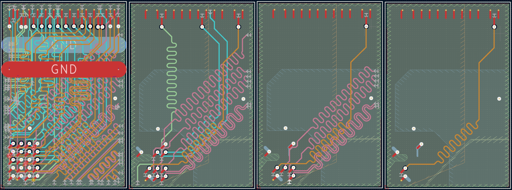

# Quickstart guide

This guide provides instructions for preparing input for [gerber2ems](https://github.com/antmicro/gerber2ems),
using Antmicro's open source [SO-DIMM DDR5 Tester](https://github.com/antmicro/sodimm-ddr5-tester)
as an example.

## Clone the board

```bash
git clone https://github.com/antmicro/sodimm-ddr5-tester.git
cd sodimm-ddr5-tester
```

## Define nets to be sliced

The following sample traces were selected for the guide:

- `/DDR5 SODIMM/A.CA0`
- `/DDR5 SODIMM/A.DQ1`
- `/FPGA MGT Interface/PCIE.CLK_P`
- `/FPGA MGT Interface/PCIE.CLK_N`

To create slices for selected nets, the `init.json`
file should be created with following content:

```json

{
  "netclass": "",
  "nets": [
    "/DDR5 SODIMM/A.CA0",
    "/DDR5 SODIMM/A.DQ12",
    "/FPGA MGT Interface/PCIE.CLK_P",
    "/FPGA MGT Interface/PCIE.CLK_N"
  ]
}
```

To create the file, run:

```bash
echo '{
  "netclass": "",
  "nets": [
    "/DDR5 SODIMM/A.CA0",
    "/DDR5 SODIMM/A.DQ1",
    "/FPGA MGT Interface/PCIE.CLK_P",
    "/FPGA MGT Interface/PCIE.CLK_N"
  ]
}' > init.json
```

## Generate configuration for the slicer

Create the `net_configs` directory and use `wrapper_settings` to generate
a configuration file for each net:

```bash
mkdir net_configs/
si-wrapper settings -i init.json -o net_configs
```

## Generate slices

```bash
for file in net_configs/*; do 
    si-wrapper slice -f $file  
done
```

As a result, the `slices` directory should be created
containing subdirectories named as nets.

## Simulate using gerber2ems

Following the [installation guide](https://github.com/antmicro/gerber2ems?tab=readme-ov-file#installation),
clone and install [gerber2ems](https://github.com/antmicro/gerber2ems).

Enter the `slices` directory and follow the instructions from the
[gerber2ems README](https://github.com/antmicro/gerber2ems/blob/main/README.md)
to perform simulation.

## Generate bitmaps of created slices

> Note: This step is optional.

```bash
cd slices
for dir in ./*/; do
    cd $dir
    kicad-cli pcb export gerbers --no-protel-ext -o fab/ *.kicad_pcb
    kicad-cli pcb export drill --format gerber --excellon-separate-th -o fab/ *.kicad_pcb
    si-wrapper gerber2png
    cd ../
done
```

> Note: Optionally, [kicad-make](https://github.com/antmicro/kicad-make) can be used
to aid the process of KiCad output generation by replacing:
>
>```bash
>kicad-cli pcb export gerbers --no-protel-ext -o fab/ *.kicad_pcb
>kicad-cli pcb export drill --format gerber --excellon-separate-th -o fab/ *.kicad_pcb
>```
>
>with
>
>```bash
>kmake gerber -xe
>```

## Slicing examples

Below, you can see examples of generated slices for the `/DDR5 SODIMM/B.DQ12` net
with different settings for neighboring. The first one has no reduced layout,
the second has the neighboring net threshold set to 2 neighboring points,
the third to 10 neighboring points and
the fourth to 50 neighboring points.
The neighboring net distance offset is set to 0.3 mm for each case.


