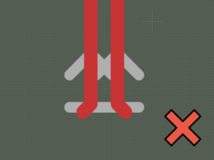
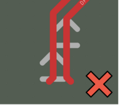
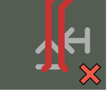
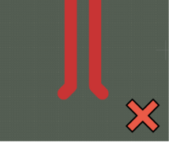

# Usage

**Usage**:

```console
> si-wrapper [OPTIONS] COMMAND [ARGS]...
```

**Options**:

* `--help`: Show this message and exit.

**Commands**:

* `slice`: Generates simulation cases by creating slices of designated nets
* `renumerate`: Allows you to remove unused `Simulation Port` footprints from
    the generated slice and automatically updates the `simulation.json` file.
* `settings`: Generates configuration files for the net-slices
    from the source PCB.
* `gerber2png`: Generates a bitmap `.png` file of the selected net.

---

## `si-wrapper slice`

Generates simulation cases by creating slices of designated nets

**Usage**:

```console
> si-wrapper slice [OPTIONS]
```

**Options**:

* `-f, --file PATH`: Path to settings file
* `-l, --list`: List Net classes with corresponding nets
* `--debug`: Increase logs verbosity
* `--help`: Show this message and exit.

**Overview**:

This script generates simulation cases by creating slices of designated nets
from the source PCB.
The script generates a directory called ``slices``, with the following structure:

```bash
slices/
└── desgnated_net_name/
  ├── simulation.json
  ├── designated_net_name.kicad_pcb
  ├── designated_net_name.kicad_prl
  └── designated_net_name.kicad_pro
```

To run the script with the slice config, type:

```bash
si-wrapper slice -s path_to/slice_config.json
```

* To run help, type:

    ```bash
    si-wrapper slice --help
    ```

* To check nets and class membership, type:

    ```bash
    si-wrapper slice -l/--list 
    ```

* To run in debug mode, add:

    ```bash
    --debug
    ```


The resulting PCB slices are stored as a separate KiCad PCB project and
can be previewed after generation.

A single PCB slice represents a sub-region of the source PCB that contains a specified,
impedance-controlled single net or differential pair.
The size of each slice is determined by the geometrical span of the designated net(s).
The script contains its own configuration file which allows
altering the slicing method.
In particular, the configuration file allows setting:

* size of a margin added to the minimal dimension
* neighboring nets that should be included in the slice
* neighboring nets that should be dropped and omitted in the slice

A PCB slice prepared for simulation contains the selected net(s), copper planes,
vias and neighboring nets (selected in the configuration file).
Passive elements placed in a series with the selected net (0 Ohm resistors
and significantly large capacitors) are replaced with shorts.
Given its validity for our frequencies of interest, this approximation
enables us to circumvent the current limitations of the OpenEMS simulator.
Power nets and low speed interfaces are terminated to ground (GND).
The designated net and neighboring nets are terminated with
Simulation Ports (SP) which indicate their nominal impedance.

---

## `si-wrapper renumerate`

Allows you to remove unused `Simulation Port` footprints from
the generated slice and automatically updates the `simulation.json` file.

**Usage**:

```console
> si-wrapper renumerate [OPTIONS]
```

**Options**:

* `--help`: Show this message and exit.

**Overview**:

This script allows users to remove additional Simulation Port footprints
from the generated slice and automatically updates the `simulation.json` file.
If the `si-wrapper slice` script fails to identify the correct number of
ports - **which for a single net is 2**,
and **for a differential pair is 4** - it prompts the user to adjust the port placement.
If too many Simulation Ports were placed on the slice, use the script to
renumerate them and update the `simulation.json` file.
Remove redundant ones and fix those with incorrect offset.

> **Warning:** It can only update ports already existing
on the board - not the ones added manually.

To use the script, follow the steps below:

1. Remove redundant Simulation Ports from the created slice.
Correct those placed in the wrong position - see [examples](#placing-simulation-ports).
2. Use the script inside `slices/desgnated_net_name`.
3. Inspect `simulation.json`. The script automatically updates `simulation.json`,
but it is highly recommended to check if everything was generated correctly.

To run it, use:

```bash
si-wrapper renumerate 
```

### Placing Simulation Ports

Correct:


Acceptable:


Incorrect:








> **Important:** Remember that the Simulation Port must be placed over the GND layer.
> It also must not touch other nets or planes that are not related.

### Requirements for Simulation Ports placement

Below, you can find a list of rules that define the way of placing Simulation Ports:

* `Simulation_Port` is a footprint,
* The maximum number of Simulation Ports placed
    on a slice prepared for simulation is 8,
* All Simulation Ports are placed at the beginning and end of the nets,
* Every single net available on the slice can have more than
    two Simulation Ports, but only one Port's `"excite:"` value set
    in `simulation.json` can be set as `true`,
* Simulation Ports spearheads are facing each other on the same net,
* Simulation Ports are named and numbered from SP1 to SPx,
    where x is a natural number and is equal
    to the number of ports placed on the cutout,
* Simulation Ports have rotation that is a multiple of 90 degrees,
* Simulation Ports have to be placed above/under the GND Plane,
    otherwise the simulation will be corrupted,
* Simulation Port spearheads have to be placed at the beginning of the track.

---

## `si-wrapper settings`

Generates configuration files for the net-slices from the source PCB.

**Usage**:

```console
> si-wrapper settings [OPTIONS]
```

**Options**:

* `-i, --input PATH`: Initial .json input path
* `-o, --output PATH`: Net config output path
* `--help`: Show this message and exit.

**Overview**:

Create an `init.json` file:

```json
{
  "netclass": "all",
  "nets": []
}
```

Define `netclass` or simply type `all` to create a configuration for every net.
If netclass is left empty, the nets field can be filled with selected nets.

Define the input `-i` file and output `-o` directory, where
[configuration files](#single-configuration-file-description)
are going to be generated.

```bash
si-wrapper settings -i init.json -o net_configs/
```

### Single configuration file description

Configuration of each slice can be done by modifying `slice_config.json`,
as shown below:

```json
{
  "designated_nets":[
    "net_P", "net_N" 
  ],
  "board_offset": {
      "top": 1,
      "bottom": 1,
      "left": 1,
      "right": 1
    },
  "included_pads": [
    "R1", "R2"
  ],
  "excluded_pads": [
    "R3", "R4",
  ],
  "hidden_pads": {
    "designated_net": true,
    "other_nets": true
  },
  "neighbouring_nets": {
    "in_use": true
    "offset": 0.5,
    "common_points": 10,
    "netlist": [
      "neighbour_net1", "neighbour_net2"
    ]
  }
}
```

Below, you can find description of each field:

* `designated_nets` - list of nets that are designated for simulation.
    For single-ended - add one name of the net, ex: `["/SDA"]`.
    For a differential pair - add both names, ex: `["CSI_D0_P", "CSI_D0_N"]`.
    When adding a differential pair, first enter the positive net `_P`,
    then the negative `_N`.
   > **Note** If any net in the generated slice has Simulation Ports placed in
   > unwanted locations, you should perform slicing again with a modified `excluded_pads`
   > field. This prevents placing Simulation Ports in unwanted locations on the pads.
* `board_offset` - allows defining the offset from the designated net's
    maximum and minimum positions. It defines the size of the board after slicing.
* `included_pads` - list of components that can contain Simulation Ports on the pads.
* `excluded_pads` - list of components that can't contain
    Simulation Ports on the pads.
* `hidden_pads/designated_net` -  hides pads where Simulation Ports are placed
    on designated nets. Recommended: `True`.
* `hidden_pads/other_nets` - hides pads where Simulation Ports are placed
    on other nets. Recommended: `True`.
* `neighbouring_nets/in_use` - defines if the `neighbouring_nets` feature is in use.
* `neighbouring_nets/offset` - sets the distance in millimeters,
    both vertically and horizontally, for designated nets,
    defining the area where a neighboring track may occur.
* `neighbouring_nets/common_points` - determines the lower limit for the number
    of common points of neighboring tracks with the area defined by`neighbouring_nets/offset`.
    A net whose tracks do not fulfill this requirement is removed.
* `neighbouring_nets/netlist` - users can specify the name of the neighbors
    manually and make sure that they are not going to be removed.

---

## `si-wrapper gerber2png`

Generates a bitmap `.png` file of the selected net.

**Usage**:

```console
> si-wrapper gerber2png [OPTIONS]
```

**Options**:

* `--help`: Show this message and exit.

**Overview**:

To create a bitmap `.png` file of the selected net,
first you have to clean the board manually from additional elements such as
footprints, vias, planes.

`cd` to directory containing the `.kicad_pcb` file.
To use the script:

* Create slices, for example by following the [Quickstart guide](quick-start.md)
* Create bitmaps by running the following snippet in the repo directory:

    ```bash
    kicad-cli pcb export gerbers --no-protel-ext -o fab/ *.kicad_pcb
    kicad-cli pcb export drill --format gerber --excellon-separate-th -o fab/ *.kicad_pcb
    si-wrapper gerber2png
    ```
